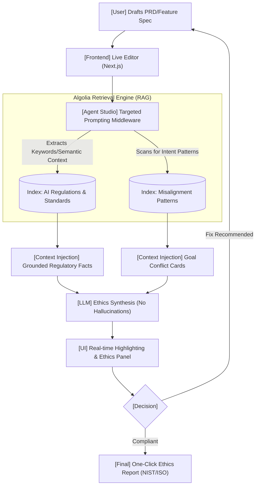

# AI Ethics Guardian: Visual Workflow

This diagram illustrates how the system leverages Algolia Agent Studio to provide real-time, grounded ethical auditing.

## Step-by-Step Logic
1.  **Drafting**: The user enters text (e.g., "Add user sentiment tracking to maximize app retention").
2.  **Extraction**: The system sends chunks of text to Algolia.
3.  **Retrieval**: Algolia retrieves **Article 6 (High-Risk Systems)** and **GDPR Profiling** rules.
4.  **Synthesis**: The LLM, constrained by the retrieved context, explains the risk: *"Tracking sentiment for retention may lead to 'dark patterns' prohibited by IEEE 7000 value-based design."*
5.  **Audit**: The UI highlights the text in yellow and provides a direct link to the regulation.
6.  **Certification**: When the SPEC is finalized, the system generates a traceability report citing every standard it complied with.
